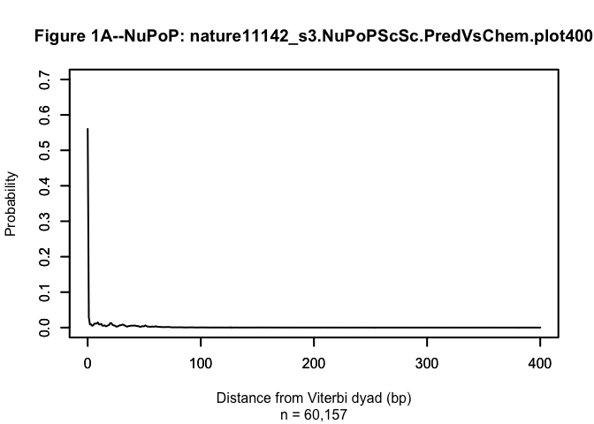
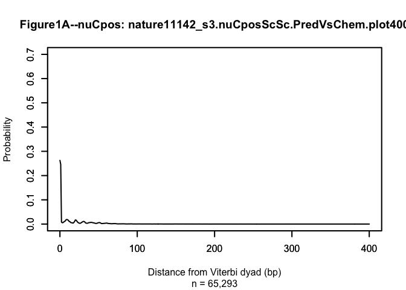
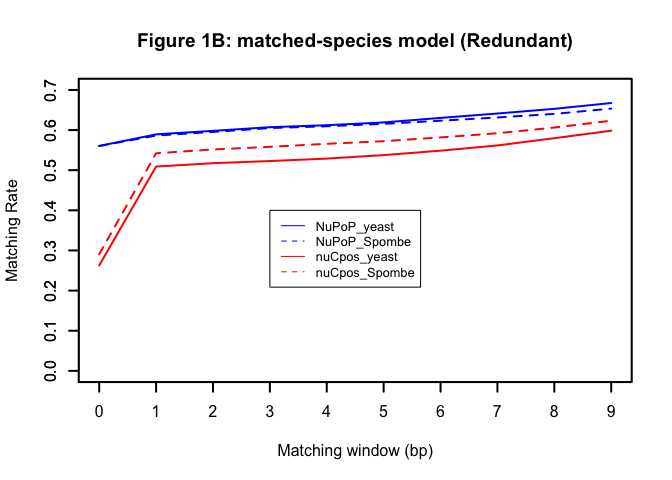
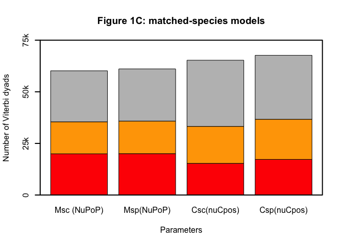

Comparison of NuPoP (V2.4.0) and nuCpos (v1.14)
================
Ji-Ping Wang
2022-07-31

## What is NuPoP?

NuPoP is tool developed by my group in 2010 and was deposited to
Bioconductor in 2010. It’s a tool based on a duration hidden Markov
model (dHMM) for prediction of nucleosome positioning. It has three
formats when it was developed, a stand-alone Fortran program (my
github), an R package (currently available at Bioconductor and my
github) which is an R wrapper of Fortran program, a web server which was
paused three years ago. The Fortran codes in the R package essentially
does all functions of the package. The paper accompanying this tool was
published in BMC Bioinformatics in 2010. More references on NuPoP can be
found at my github website: <https://github.com/jipingw/NuPoP>.

NuPoP was originally trained based on MNase maps when it was developed.
In Nov, 2020, additional functions were included by adding HMM profiles
trained based on chemical maps of nucleosome positioning for yeast,
S.pombe, Mouse and Human. Note the chemical maps for all the four
species were published from my and my collaborator’s lab (yeast
<https://www.nature.com/articles/nature11142>, S.pombe
<https://www.pnas.org/doi/abs/10.1073/pnas.1315809110>, Mouse
<https://pubmed.ncbi.nlm.nih.gov/27889238/>). The major update date can
be found at my github website of NuPoP
<https://github.com/jipingw/NuPoP>.

## What is nuCpos?

nuCpos package is a derivative of NuPoP by Hiroaki Kato and Takeshi
Urano for the exactly same purpose of nucleosome positioning prediction.
The core Fortran codes for duration HMM of NuPoP were completely ported
from NuPoP to nuCpos. nuCpos only has chemical-map based predictions
where authors trained for yeast, Spombe and mouse separately.

## 2. Comparison of nuCpos (V1.14) vs. NuPoP (V2.4)

**The authors Hiroaki Kato , Mitsuhiro Shimizu and Takeshi Urano
published a paper entitled *Chemical map‑based prediction of nucleosome
positioning using the Bioconductor package nuCpos* in BMC Bioinformatics
in June 2021
<https://bmcbioinformatics.biomedcentral.com/articles/10.1186/s12859-021-04240-2>.
They compared the MNase-base prediction of NuPoP (version 1.34) with
nuCpos chemical-based prediction and showed that nuCpos had superior
prediction than NuPoP. However it should be noted that chemical map
trained prediction had become available in Nov 2020 (NuPoP V1.99 and
later on) via function `predNuPoP_chem`. This fact was ignored by the
authors. Thus the conclusion drawn by the authors in their paper DOES
NOT reflect the fact of true performance comparison of the two
packages.**

To compare nuCpos (V1.14) with NuPoP (V2.4, same version submitted to
bioconductor in Nov 2020) I followed the author’s codes available at
<https://doi.org/10.5281/zenodo.3362065> and
<https://doi.org/10.5281/zenodo.4083950>. In the version as of
07/31/2022, there were two major bugs in the codes in the published
codes, one in `sc_genome.R`, and the other in `yeast_genome.R`. They
must be rectified before reproducing the results.

------------------------------------------------------------------------

### Assessment of nuCpos performance vs. NuPoP

To compare `nuCpos` vs `NuPoP`, it’s unfair to compare chemical map
trained `nuCpos` with MNase-trained `NuPoP` funcitons, as they are
trained for different purpose. MNase trained model can provide insights
into nucleosome positioning if MNase assay is performed, while chemical
map trained tools cannot. Here we compare `nuCpos` with `predNuPoP_chem`
implemented in NuPoP in 2020. The latter was trained based on the
chemical maps generated from my lab. We compare the performance of the
two tools using yeast, and Spombe as demonstration below. Every step in
the `README.md` file was followed. The following is Figure 1 from this
paper by H. Kato , M.Shimizu and T. Urano:


------------------------------------------------------------------------

### Reproducing Figure 1A

The following codes were exerpted from Figure.R from the afore-mentioned
supplementary website.

``` r
load(file = "/Users/jon/Rpack/nuCpos/HOMEDIR/RData/nature11142_s3.NuPoPScSc.PredVsChem.plot400.RData")
load(file = "/Users/jon/Rpack/nuCpos/HOMEDIR/RData/nature11142_s3.nuCposScSc.PredVsChem.plot400.RData")
ylim <- c(0,0.7)
xlim <- c(0,400)
## Figure 1A, NuPoP
plot(x = seq(0,400,1), y = nature11142_s3.NuPoPScSc.PredVsChem.plot400$prob[1:401], type = "l",
    main = "Figure 1A--NuPoP: nature11142_s3.NuPoPScSc.PredVsChem.plot400", sub = "n = 60,157",
    ylab = "Probability",
    xlab = "Distance from Viterbi dyad (bp)", ylim =ylim , xlim = xlim,
    lwd = 2)
box(lwd = 2)
axis(side = 1, lwd.ticks = 2)
axis(side = 2, lwd.ticks = 2)
```

<!-- -->

``` r
##
plot(x = seq(0,400,1), y = nature11142_s3.nuCposScSc.PredVsChem.plot400$prob[1:401], type = "l",
    main = "Figure1A--nuCpos: nature11142_s3.nuCposScSc.PredVsChem.plot400", sub = "n = 65,293",
    ylab = "Probability",
    xlab = "Distance from Viterbi dyad (bp)", ylim = ylim, xlim = xlim,
    lwd = 2)
box(lwd = 2)
axis(side = 1, lwd.ticks = 2)
axis(side = 2, lwd.ticks = 2)
```

<!-- -->

**Observation: Figure 1A for `nuCpos` as shown in the paper was
successfully reproduced. `NuPoP` predicts nucleosomes 58% (33,714 out of
60,157) exactly matched the annotated in-vivo nucloesomes from the
Nature paper, in contrast to 26% (17,147of 65,293) from `nuCpos`
matching original nature paper.**

------------------------------------------------------------------------

### Reproducing Figure 1B

``` r
load(file = "/Users/jon/Rpack/nuCpos/HOMEDIR/RData/Rate_Redundant_yeasts.RData")
load(file = "/Users/jon/Rpack/nuCpos/HOMEDIR/RData/Rate_Unique_yeasts.RData")
## Figure S2, matched-species model (Redundant)
plot(x = 0:9, y = numeric(length = 10), type = "n", ylim = c(0, 0.7),
    xaxt = "n", xlab = "Matching window (bp)", ylab = "Matching Rate",
    main = "Figure 1B: matched-species model (Redundant)")
lines(x = 0:9, y = Rate.Redundant[Rate.Redundant$Prefix == "NuPoPScSc", 2:11],
    lwd = 2, lty = 1, col = "blue")
lines(x = 0:9, y = Rate.Redundant[Rate.Redundant$Prefix == "NuPoPSpSp", 2:11],
    lwd = 2, lty = 2, col = "blue")
lines(x = 0:9, y = Rate.Redundant[Rate.Redundant$Prefix == "nuCposScSc", 2:11],
    lwd = 2, lty = 1, col = "red")
lines(x = 0:9, y = Rate.Redundant[Rate.Redundant$Prefix == "nuCposSpSp", 2:11],
    lwd = 2, lty = 2, col = "red")
box(lwd = 2)
axis(side = 1, lwd.ticks = 2, at = 0:9, labels = as.character(0:9))
axis(side = 2, lwd.ticks = 2)
legend(3,0.4,legend=c("NuPoP_yeast","NuPoP_Spombe","nuCpos_yeast","nuCpos_Spombe"),col=c("blue","blue","red","red"),lty=c(1,2,1,2),cex=0.8)
```

<!-- -->

**Observation:Figure 1B for `nuCpos` as shown in the paper was
successfully reproduced. However `NuPoP` dramatically outperforms
`nuCpos`. in prediciton accuracy **

------------------------------------------------------------------------

### Reproducing Figure 1C

``` r
load(file = "/Users/jon/Rpack/nuCpos/HOMEDIR/RData/AUC_summary_yeasts.RData")
load(file = "/Users/jon/Rpack/nuCpos/HOMEDIR/RData/num_summary_yeasts.RData")
## Figure 1B, matched-species models
COL <- adjustcolor(c("red", "orange", "gray"), alpha.f = 1)
HEIGHT <- t(as.matrix(num.Summary[,c(10,14,15)]))[,c(1,6,3,8)]
colnames(HEIGHT) <- c("Msc (NuPoP)", "Msp(NuPoP)", "Csc(nuCpos)", "Csp(nuCpos)")
barplot(height = HEIGHT,
    main = "Figure 1C: matched-species models",
    ylab = "Number of Viterbi dyads", ylim = c(0, 75000), yaxt = "n",
    xlab = "Parameters", col = COL, lwd = 2)
box(lwd = 2)
axis(side = 2, lwd.ticks = 2, at = c(0, 25000, 50000, 75000), labels = c("0", "25k", "50k", "75k"))
```

<!-- -->

Note in Figure 1C above, I keep the same label as in original paper
where Msc – NuPoP prediciton for cerevisiaeusing cerevisiae model; Msp –
NuPoP prediction for spombe using spombe model; Csc – nuCpos prediction
cerevisiae using cerevisiae model; Csp – nuCpos prediction for spombe
using spombe model.

**Observtion 1: Figure 1C for `nuCpos` as shown in the paper was
successfully reproduced (i.e. Csc, Csp). Regardless that NuPoP predicts
less unique nucleosomes in cerevisiae and spombe, i.e., 60,157, 55,279
in comparison to 65,293 and 60,683, the number of nucleosomes sitting
within 2bp window of annotated unique nucleosomes from the nature paper
are 35,451 (33%) vs 33,241 (23%) for yeast, and 23,742 (16%) vs 22,261
(12%) for Spombe respectively. These numbers can be found from
`num.Summary` and `AUC.summary` as follows:**

``` r
num.Summary
```

    ##       Prefix Package Target Model Genome.size Num.Unique Num.Redundant
    ## 1  NuPoPScSc   NuPoP     Sc    Sc    12071326      67548        344709
    ## 2  NuPoPScSp   NuPoP     Sc    Sp    12071326      67548        344709
    ## 3 nuCposScSc  nuCpos     Sc    Sc    12071326      67548        344709
    ## 4 nuCposScSp  nuCpos     Sc    Sp    12071326      67548        344709
    ## 5  NuPoPSpSc   NuPoP     Sp    Sc    12571820      75828        425653
    ## 6  NuPoPSpSp   NuPoP     Sp    Sp    12571820      75828        425653
    ## 7 nuCposSpSc  nuCpos     Sp    Sc    12571820      75828        425653
    ## 8 nuCposSpSp  nuCpos     Sp    Sp    12571820      75828        425653
    ##   Predicted Viterbi UniqueW1 RedundantW1 Rate.UniqueW1 Rate.RedundantW1
    ## 1   1002666   60157    19960       35451     0.3317985        0.5893080
    ## 2   1145970   55279     8862       23742     0.1603140        0.4294940
    ## 3   2890137   65293    15327       33241     0.2347419        0.5091051
    ## 4   2933607   60683     7238       22261     0.1192756        0.3668408
    ## 5   1239138   63595    10084       25189     0.1585659        0.3960846
    ## 6   1107690   61089    20044       35820     0.3281114        0.5863576
    ## 7   3265303   68851     9356       25558     0.1358876        0.3712074
    ## 8   2888281   67671    17247       36689     0.2548655        0.5421673
    ##   RedOnlyW1 OthersW1
    ## 1     15491    24706
    ## 2     14880    31537
    ## 3     17914    32052
    ## 4     15023    38422
    ## 5     15105    38406
    ## 6     15776    25269
    ## 7     16202    43293
    ## 8     19442    30982

``` r
AUC.summary
```

    ##       Prefix Package Target Model AUC.UniqueW0 AUC.RedundantW0
    ## 1  NuPoPScSc   NuPoP     Sc    Sc    0.8033944       0.7016484
    ## 2  NuPoPScSp   NuPoP     Sc    Sp    0.7010617       0.6601376
    ## 3 nuCposScSc  nuCpos     Sc    Sc    0.7506980       0.6745802
    ## 4 nuCposScSp  nuCpos     Sc    Sp    0.6623388       0.6313702
    ## 5  NuPoPSpSc   NuPoP     Sp    Sc    0.6924337       0.6409260
    ## 6  NuPoPSpSp   NuPoP     Sp    Sp    0.7884132       0.6857224
    ## 7 nuCposSpSc  nuCpos     Sp    Sc    0.6668910       0.6255247
    ## 8 nuCposSpSp  nuCpos     Sp    Sp    0.7432545       0.6674207

**Observation 2: This big gap is also observed in the cross-species
predictions. Virtually in every aspect including the AUC curves of every
comparison, `NuPoP` predictions are significantly better than `nuCpos`,
as shown in num.Summary and AUC.summary tables.**

## Conclusion

NuPoP (v2.4) shows significantly better performance than nuCpos (V1.14)
in nucleosome positioning prediction when using chemical map trained
models.

## Acknowledgement

I want to thank the authors Hiroaki Kato , Mitsuhiro Shimizu and Takeshi
Urano to provide the codes such that I can reproduce some of their
results for this assessment.
